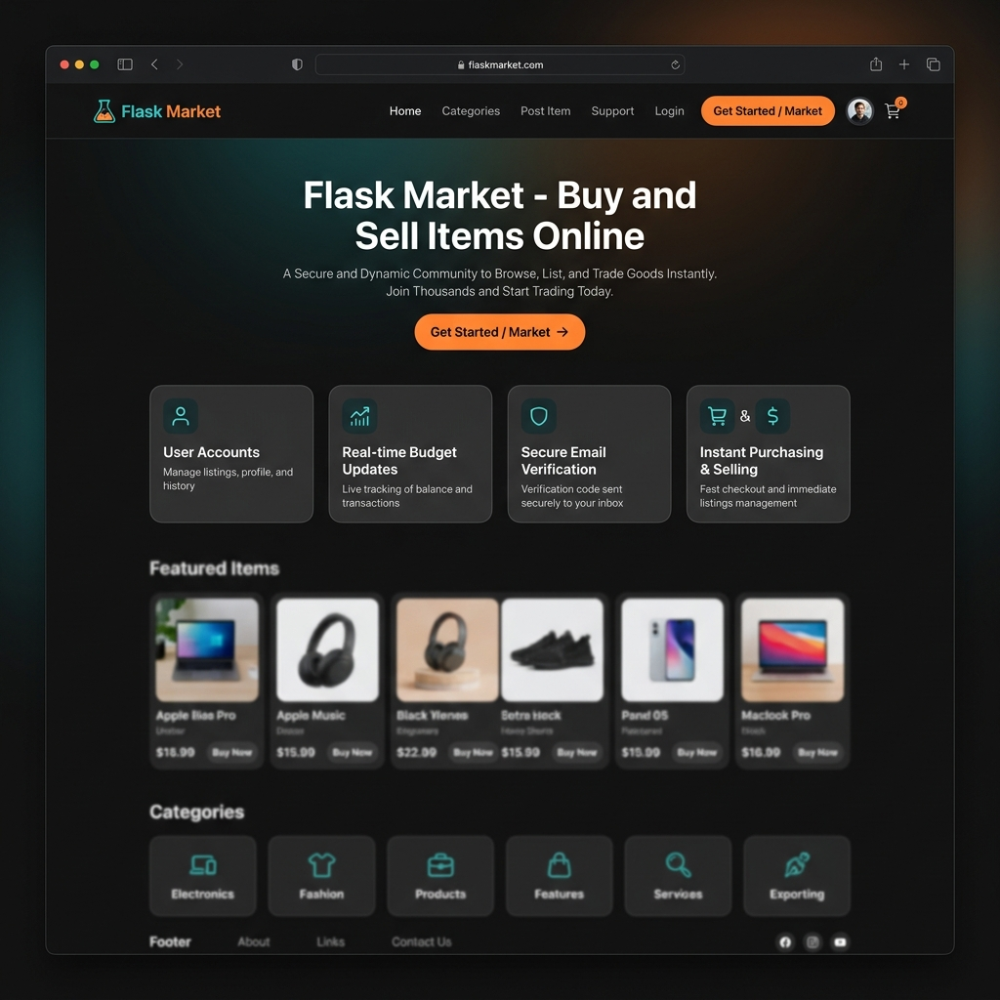
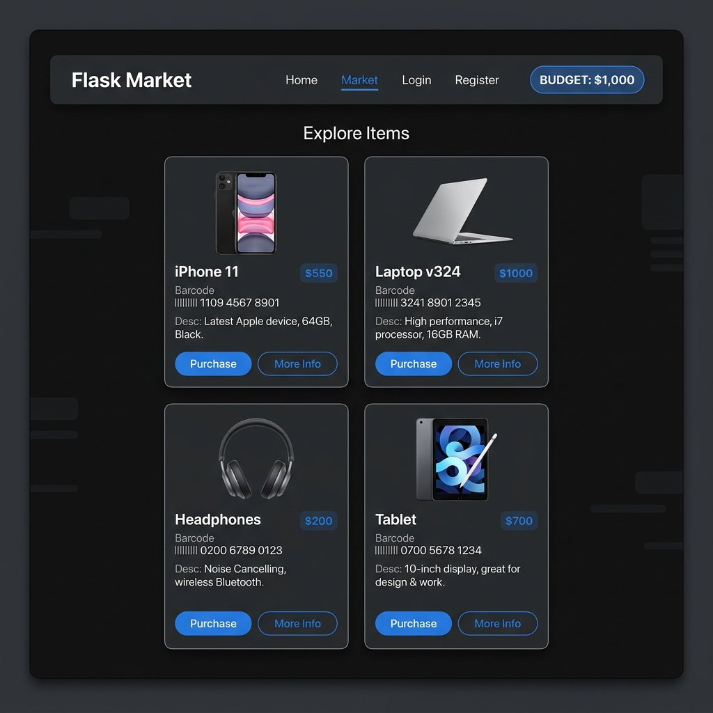

# 🛒 Flask Market

A full-stack e-commerce marketplace web application built with **Python (Flask)**, **SQLAlchemy**, **Bootstrap 4**, **Flask-Login**, and **Flask-Mail**. Flask Market enables registered users to browse products, purchase items using a virtual budget system, list owned items back for sale, and manage secure accounts with email verification.

It is also optimized for serverless deployment on **AWS Lambda** & **AWS API Gateway**.

---

## 🌟 Live Demo & Repository

- 🌐 **Live AWS Deployment**: [https://v6gt1l5yf9.execute-api.ap-south-1.amazonaws.com](https://v6gt1l5yf9.execute-api.ap-south-1.amazonaws.com)
- 📦 **GitHub Repository**: [https://github.com/GR00To/Flask_Market](https://github.com/GR00To/Flask_Market)

---

## 🖼️ Screenshots

| Home Page | Marketplace Dashboard |
| :---: | :---: |
|  |  |

---

## ✨ Features

- 👤 **User Authentication & Authorization**:
  - Secure registration and login with password hashing via `Flask-Bcrypt`.
  - Token-based email verification using `itsdangerous` and `Flask-Mail`.
  - Protected routes restricting marketplace access to verified and authenticated users.
- 🛍️ **Interactive Marketplace**:
  - Browse available items with barcodes, detailed descriptions, and prices.
  - Interactive modals for confirming purchases and selling owned items.
- 💰 **Dynamic Budget System**:
  - Starting budget of **$1,000** assigned to new verified user accounts.
  - Automatic balance updates upon buying or selling items.
  - Built-in validation preventing purchases if funds are insufficient.
- 🛡️ **Security & Optimization**:
  - Session security configuration (`Lax` cookies, `ProxyFix` middleware).
  - SQL injection prevention via SQLAlchemy ORM parameterization.
- ☁️ **AWS Serverless Ready**:
  - `serverless-wsgi` adapter for seamless execution on AWS Lambda.
  - Automated deployment script (`deploy_to_aws.py`) provisioning IAM execution roles, Lambda functions, and HTTP API Gateways.

---

## 🛠️ Technology Stack

| Category | Technologies / Libraries |
| :--- | :--- |
| **Backend** | Python 3.11, Flask 3.1, WSGI (`serverless-wsgi`) |
| **Database & ORM** | SQLite 3, Flask-SQLAlchemy 3.1 |
| **Authentication & Security** | Flask-Login 0.6, Flask-Bcrypt 1.0, Flask-WTF / WTForms 3.2 |
| **Email Services** | Flask-Mail 0.10, `itsdangerous` (Timed Serializer) |
| **Frontend** | HTML5, CSS3, Bootstrap 4, Jinja2 Templating |
| **Cloud & Deployment** | AWS Lambda, AWS API Gateway (HTTP API), AWS IAM |

---

## 📂 Project Structure

```text
Flask_Project/
├── app.py                   # AWS Lambda entry point & serverless handler
├── run.py                   # Local development server entry point
├── deploy_to_aws.py         # Automated deployment script for AWS Lambda & API Gateway
├── requirements.txt         # Project dependencies
├── instance/
│   └── market.db            # SQLite database file
├── market/
│   ├── __init__.py          # Flask app initialization, configs & extensions
│   ├── models.py            # SQLAlchemy models (User, Item)
│   ├── forms.py             # WTForms (RegisterForm, LoginForm, PurchaseItemForm, SellItemForm)
│   ├── routes.py            # Route handlers & email verification logic
│   └── templates/
│       ├── base.html        # Main Jinja2 layout template with Bootstrap navbar & alerts
│       ├── home.html        # Landing page UI
│       ├── market.html      # Marketplace & owned items grid with purchase/sell modals
│       ├── login.html       # User login page
│       ├── register.html    # User registration page
│       └── includes/        # Modal components for buying and selling items
└── docs/
    └── screenshots/         # Project preview images
```

---

## 🚀 Installation & Local Setup

### Prerequisites
- **Python** 3.8 or higher installed
- **Git** installed

### 1. Clone the Repository
```bash
git clone https://github.com/GR00To/Flask_Market.git
cd Flask_Market
```

### 2. Create and Activate a Virtual Environment
```bash
# On Linux / macOS
python3 -m venv fenv
source fenv/bin/activate

# On Windows
python -m venv fenv
fenv\Scripts\activate
```

### 3. Install Dependencies
```bash
pip install -r requirements.txt
```

### 4. Configuration (Optional)
The email verification feature uses SMTP. You can configure your credentials in `market/__init__.py`:
```python
app.config['MAIL_SERVER'] = 'smtp.gmail.com'
app.config['MAIL_PORT'] = 587
app.config['MAIL_USE_TLS'] = True
app.config['MAIL_USERNAME'] = 'YOUR_EMAIL@gmail.com'
app.config['MAIL_PASSWORD'] = 'YOUR_APP_PASSWORD'
```

### 5. Run the Application Locally
```bash
python run.py
```
Open your browser and navigate to `http://127.0.0.1:5000`.

---

## ☁️ Deployment to AWS Lambda & API Gateway

This project includes an automated deployment script (`deploy_to_aws.py`) that packages the application and deploys it to AWS Lambda.

1. Ensure AWS credentials (AWS Access Key ID, Secret Key, and Region) are set in your environment or inside `deploy_to_aws.py`.
2. Run the deployment script:
```bash
python deploy_to_aws.py
```
3. The script will output your live HTTPS API Gateway URL upon completion.

---

## 🤝 Contributing

Contributions, issues, and feature requests are welcome!  
Feel free to check the [issues page](https://github.com/GR00To/Flask_Market/issues).

1. Fork the Project
2. Create your Feature Branch (`git checkout -b feature/AmazingFeature`)
3. Commit your Changes (`git commit -m 'Add some AmazingFeature'`)
4. Push to the Branch (`git push origin feature/AmazingFeature`)
5. Open a Pull Request

---

## 📜 License

Distributed under the MIT License. See `LICENSE` for more information.
